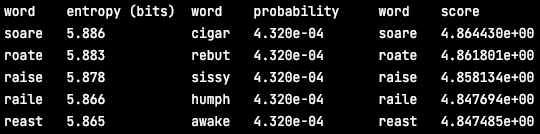
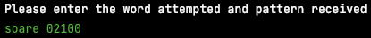

# Wordle Solver

Solver and simulator for Wordle puzzles by fxh90.

## Basic usage

For manual solver, run solver.py with Python 3. It displays words with maximal information entropy, those with maximal probability and those with maximal score (see [strategies](#strategies)).

Users can choose a word they can enter to Wordle, and receive a result from Wordle. The word they choose and the result they get should be entered back to the programme, separated by a space. Alternatively, the users can enter 'q' to exit.

A five-digit number should be used to represent the match pattern, in which 0 notes a grey digit (wrong digit), 1 notes a yellow digit (right digit at wrong place) and 2 notes a green digit (right digit at right place).

## Caching

The solver caches initial entropies, initial probabilities and a pattern LUT as pkl / npy files for faster computation. The pattern LUT cache is not included in the repository and will be computed when solver.py initialises.

## Automatic solver

There is also a solver object defined in solver.py which is implemented as a generator. It can be used as an automatic solver that can be called in another programme (e.g. simulator.py) with a given strategy.

### Strategies

Two strategies are currently implemented. There is the 'entropy first' method which guesses a word with most information entropy until there is only one possibility, and one named 'score 1' which calculates a score according to

S = (H + p) / (1.1 ^ 2 - p ^ 2),

where S is the score, H is the information entropy and p is the probability.

The performance of the two strategies can be found in log files.

## Simulator

The simulator is able to respond to the automatic solver and characterise any strategy by going over every possible answer.

## Acknowledgement

The dictionaries used for guesses and answers are imported from [Crispy's Wordle Solver](https://github.com/CrispyConductor/wordle-solver).